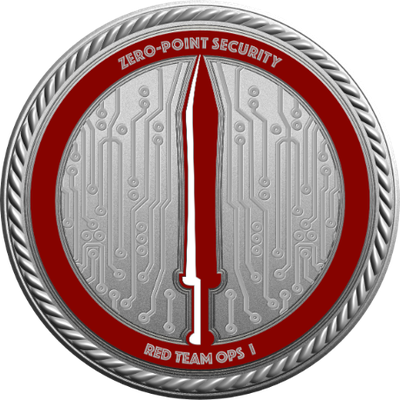

### Hi,I am yutian 👋
 
 个人博客：https://yutianqaq.github.io/   微信公众号：赛博雨天 <a style="display: inline;" href="https://xz.aliyun.com/u/29840">先知社区</a> <a style="display: inline;" href="https://y2qaq.notion.site/Blog-e4a18ba11a7f48d495b3f5e9c74cd84e">日常记录
  

<!-- -->

  
 

#### 认证

#### 开源项目
| 工具名称                                      | 项目链接                                        | 工具名称                                      | 项目链接                                        | 
| ------------------------------------------ | -------------------------------------------- | -------------------------------------------- | -------------------------------------------- |
| Spring Boot\|可定制的在线免杀平台               | [AVEvasionCraftOnline](https://github.com/yutianqaq/AVEvasionCraftOnline) | Nim\|简单快捷的 CS 一键免杀插件                   | [CSx3Ldr](https://github.com/yutianqaq/CSx3Ldr)      |
| Go\|多种Shellcode加密方式并自动生成解密方式      | [Supernova_CN](https://github.com/yutianqaq/Supernova_CN) | Nim\|免杀 - x2Ldr                              | [x2Ldr](https://github.com/yutianqaq/x2Ldr)         |
| Go\|二进制文件熵计算                               | [EntropyCalc_Go](https://github.com/yutianqaq/EntropyCalc_Go) | C\|本地分离免杀 - x1Ldr                         | [x1Ldr](https://github.com/yutianqaq/x1Ldr)         |   

#### Hackthebox

  

 

<!--
[Nim 简单快捷的 CS 一键免杀插件](https://github.com/yutianqaq/CSx3Ldr) - [Spring Boot 可定制的、在线免杀平台](https://github.com/yutianqaq/AVEvasionCraftOnline)

[Nim 免杀 - x2Ldr](https://github.com/yutianqaq/x2Ldr) - [C 本地分离免杀 - x1Ldr](https://github.com/yutianqaq/x1Ldr)

[Go 多种Shellcode加密方式并自动生成解密方式](https://github.com/yutianqaq/Supernova_CN) - [Go 二进制熵计算](https://github.com/yutianqaq/EntropyCalc_Go)

**yutianqaq/yutianqaq** is a ✨ _special_ ✨ repository because its `README.md` (this file) appears on your GitHub profile.

Here are some ideas to get you started:

- 🔭 I’m currently working on ...
- 🌱 I’m currently learning ...
- 👯 I’m looking to collaborate on ...
- 🤔 I’m looking for help with ...
- 💬 Ask me about ...
- 📫 How to reach me: ytian233@163.com
- 😄 Pronouns: ...
- ⚡ Fun fact: ...
-->
